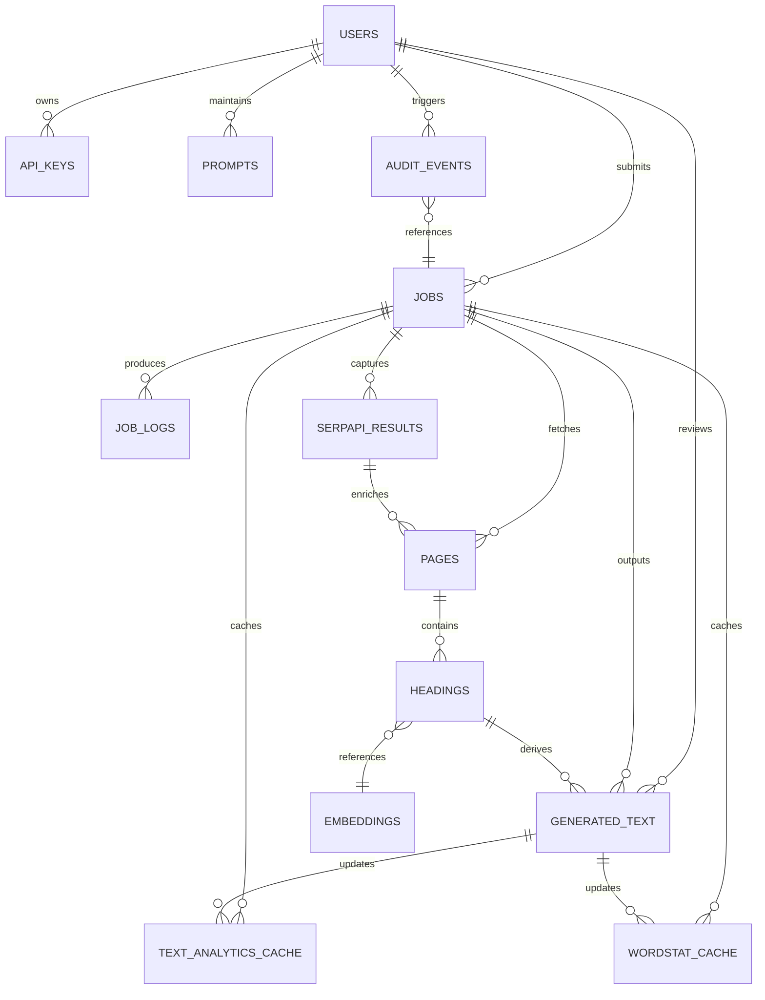

# ER-диаграмма и стратегия миграции данных

## ER-диаграмма целевой БД

```mermaid
erDiagram
    API_KEYS {
        uuid id
        uuid owner_id
        text provider
        bytea secret_ciphertext
        jsonb metadata
        timestamptz rotated_at
        timestamptz created_at
        timestamptz updated_at
    }
    JOBS {
        uuid id
        text type
        jsonb payload
        text status
        numeric progress
        uuid owner_id
        timestamptz queued_at
        timestamptz started_at
        timestamptz finished_at
        text priority
    }
    JOB_LOGS {
        uuid id
        uuid job_id
        text level
        text step
        text message
        jsonb context
        timestamptz created_at
    }
    SERPAPI_RESULTS {
        uuid id
        text keyword
        jsonb params
        jsonb raw_json
        text hash
        timestamptz fetched_at
        uuid job_id
    }
    PAGES {
        uuid id
        text url
        text title
        text lang
        text content_hash
        timestamptz fetched_at
        uuid source_job_id
    }
    HEADINGS {
        uuid id
        uuid page_id
        text level
        text text
        uuid embeddings_ref
        timestamptz created_at
    }
    EMBEDDINGS {
        uuid id
        text text_hash
        vector vector
        text model
        jsonb meta
        timestamptz created_at
    }
    GENERATED_TEXT {
        uuid id
        text section_type
        text heading
        text content
        jsonb keywords_used
        text lang
        jsonb metrics
        text status
        int version
        uuid source_heading_id
        uuid owner_id
        timestamptz created_at
    }
    PROMPTS {
        uuid id
        text key
        text body
        int version
        uuid updated_by
        timestamptz updated_at
    }
    TEXT_ANALYTICS_CACHE {
        text cache_key
        jsonb value
        timestamptz expires_at
    }
    WORDSTAT_CACHE {
        text cache_key
        jsonb value
        timestamptz expires_at
    }
    AUDIT_EVENTS {
        uuid id
        uuid actor_id
        text action
        text entity
        uuid entity_id
        jsonb metadata
        timestamptz created_at
    }
```

> **Примечания:**
> - Колонка `vector` предполагает использование расширения `pgvector` для хранения эмбеддингов.
> - Шифрование значений API ключей осуществляется с помощью `pgcrypto` (`pgp_sym_encrypt`), ключ шифрования хранится вне БД.
> - Кеши `TEXT_ANALYTICS_CACHE` и `WORDSTAT_CACHE` служат для долговременного хранения дорогих вычислений.
> - `AUDIT_EVENTS` фиксирует действия пользователей/сервисов для аудита и соответствия требованиям безопасности.

## Миграционная стратегия
1. **Подготовка инфраструктуры**
   - Развернуть PostgreSQL и Redis в новой среде Compose, убедиться в наличии `pgcrypto` и `pgvector`.
   - Создать базовые сети/volumes для бэкапов и мониторинга.

2. **Схема и миграции**
   - Сгенерировать первоначальный набор миграций Prisma (или SQL) по указанной схеме.
   - Настроить исполнение миграций в CI/CD, добавить smoke-тест подключения к БД.

3. **Интеграция с текущим монолитом**
   - Добавить в монолитный репозиторий read/write-адаптеры, которые будут писать данные как в SQLite (основной источник), так и в новую PostgreSQL (режим двойной записи). Это обеспечит постепенную синхронизацию данных.
   - Включить фоновую задачу по бэкапу SQLite → PostgreSQL (ETL), чтобы догрузить исторические данные.

4. **Верификация данных**
   - Создать временные отчёты для сверки записей (counts/ checksum) между SQLite и PostgreSQL.
   - Провести нагрузочное тестирование чтений и записи в PostgreSQL на тестовом стенде.

5. **Переключение источников**
   - Перенести чтение данных в монолите с SQLite на PostgreSQL, оставив запись в оба хранилища до стабилизации.
   - После периода наблюдения (1–2 недели) отключить запись в SQLite и заморозить его как fallback-бэкап.

6. **Запуск модульных сервисов**
   - Развернуть `api` и `worker` сервисы поверх новой БД и Redis.
   - Перенаправить внешние интеграции (SerpApi/LLM) на воркеры и отключить соответствующие части монолита.

7. **Декомиссия монолита**
   - После успешной эксплуатации модульных сервисов и отсутствия регрессий перевести монолит в read-only режим, затем выключить.

## План отката
- **Отказ API/worker**: остановить новые сервисы, переключить DNS/Ingress на старый монолит, восстановить запись в SQLite (до окончательного отключения).
- **Проблемы с БД**: поднять последний бэкап PostgreSQL; если критично — временно вернуть чтение/запись в SQLite с последующей повторной миграцией.
- **Потеря данных в очередях**: использовать резервные consumer'ы из монолита (если оставлены) либо переиграть задачи из Redis snapshot.
- **Секреты**: хранить ключи шифрования отдельно (Vault/secret store). При откате достаточно вернуть доступ к исходному хранилищу.

План миграции и отката необходимо уточнять по мере подготовки окружения и анализа объёмов данных.
